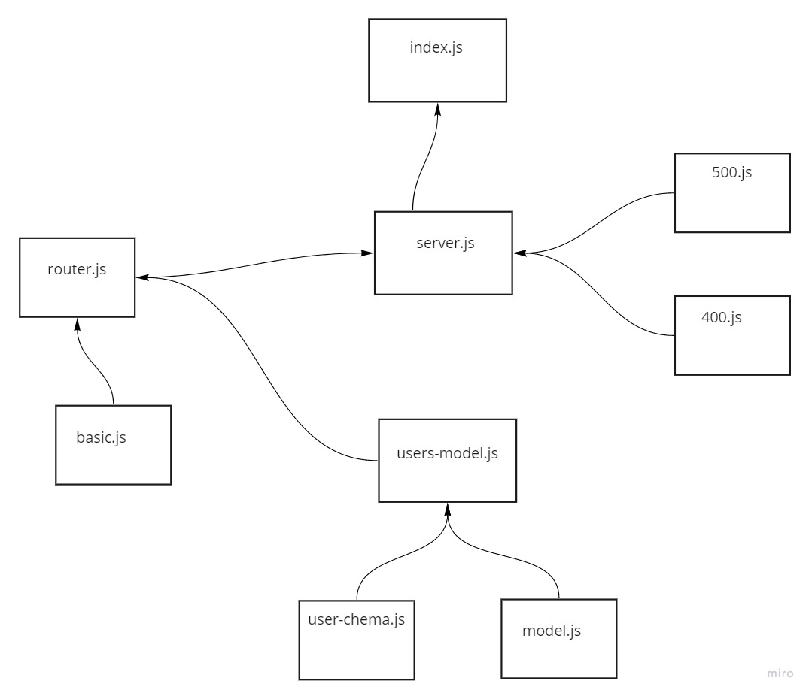
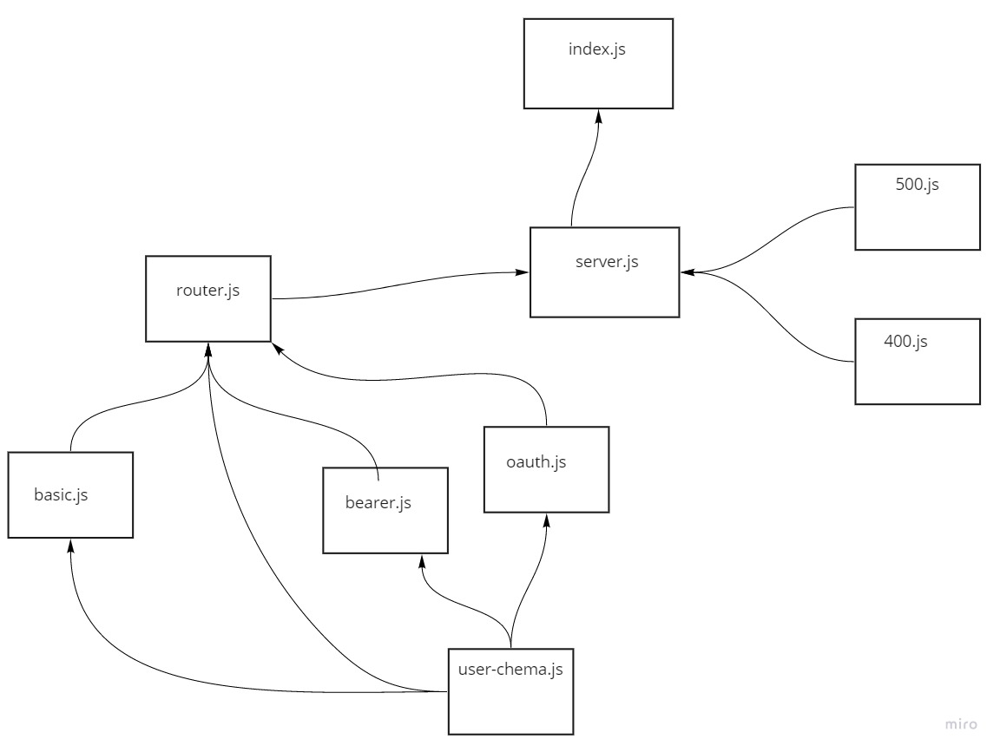

# Authentication Server / Module

An Express/Node.js based server using a custom “authentication” module that is designed to handle user registration and sign in using Basic, Bearer, or OAuth along with a custom “authorization” module that will grant/deny users access to the server based on their role or permissions level.

**Business Requirements**
Our business is expanding! We have a real need to manage a list of users of many types, and control their access to our data accordingly. The system to be built will have the following core features:

1- Users can create an account, associated with a “role”
2- User Roles will be pre-defined and will each have a list of allowed capabilities
* admin can read, create, update, delete
* editor can read, create, update
* writer can read, create
* user can read
3- Users can then login with a valid username and password
4- Alternatively, users can login using an OAuth provider such as Google or GitHub
In this case, users should be automatically assigned the role of user
5- Once logged in, Users can then access any route on the server, so long as they are permitted by the capabilities that match their role.
For example, a route that deletes records should only work if your user role is “admin”

UML lab 11

UML lab 12

